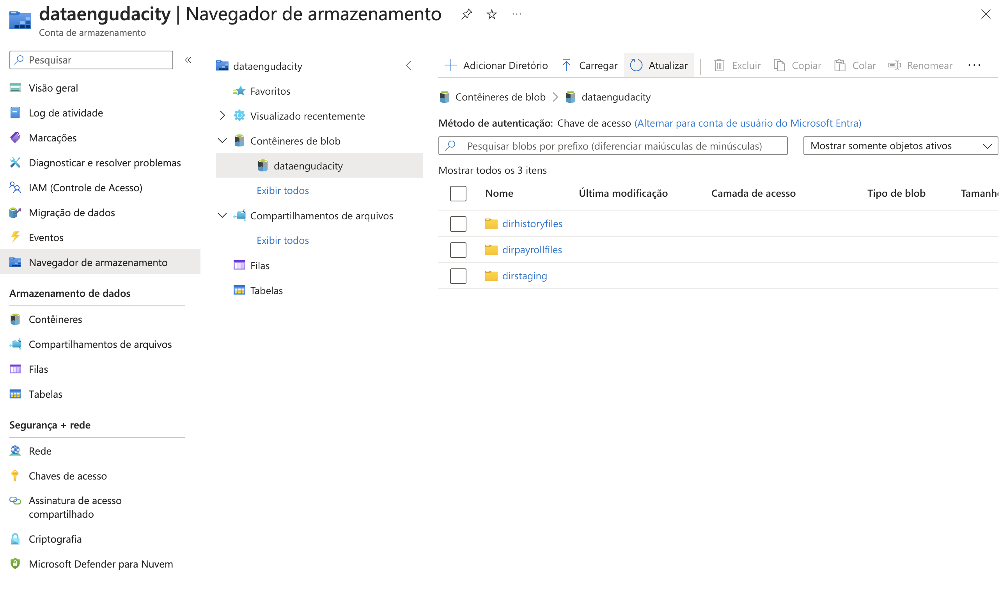
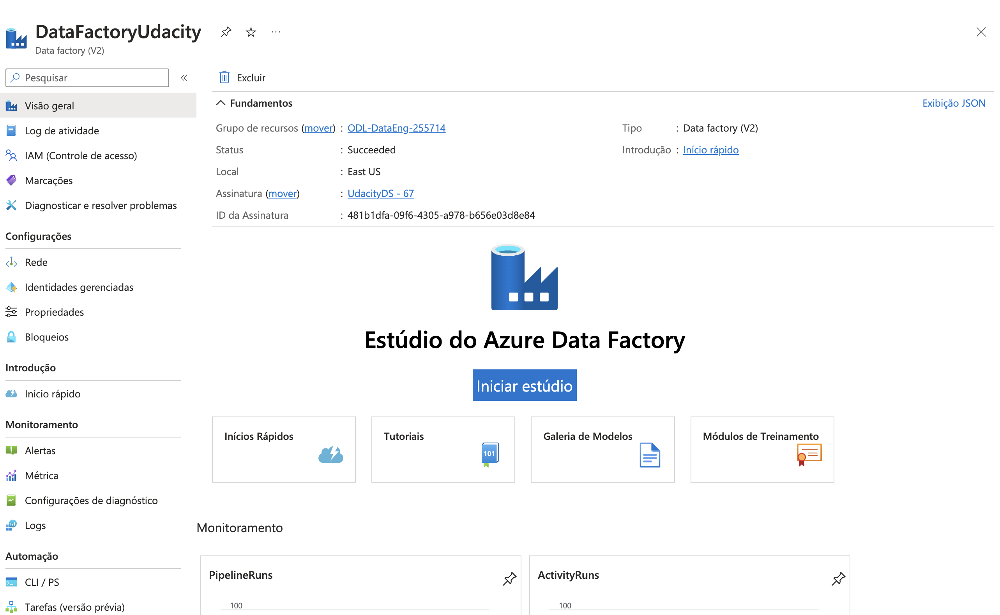
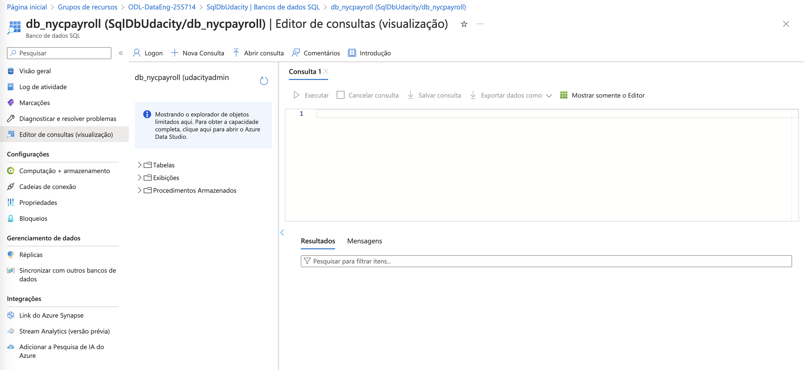
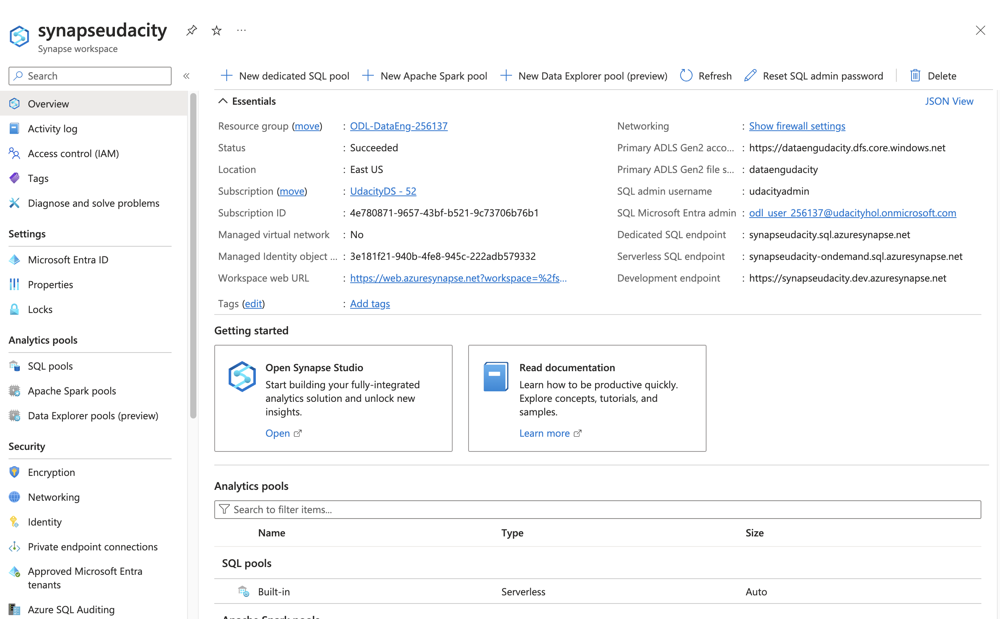
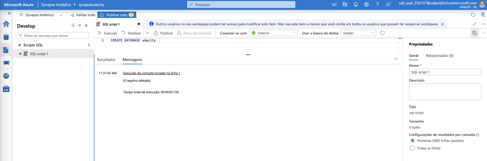
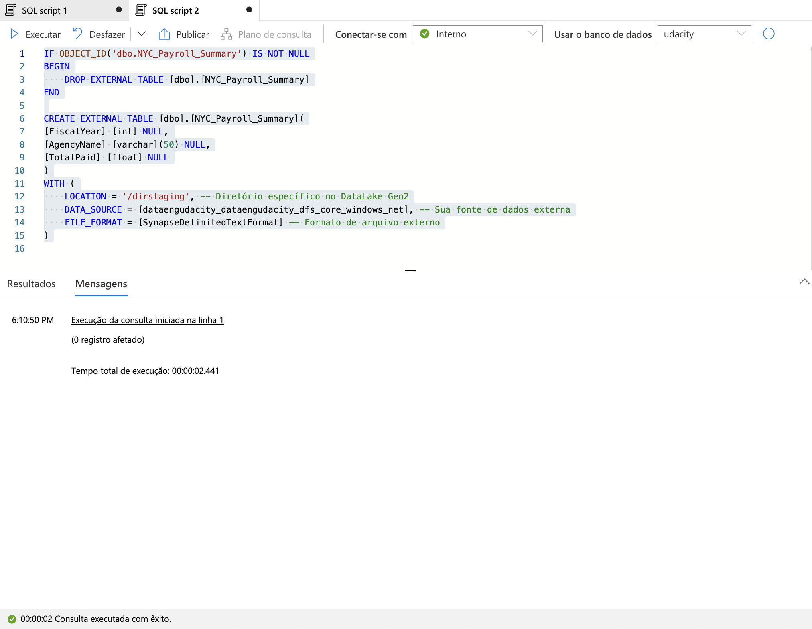
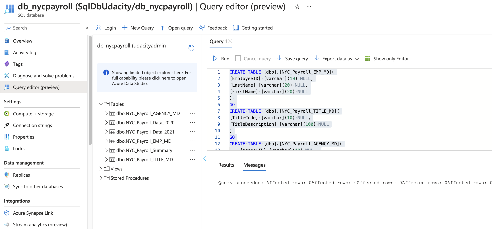
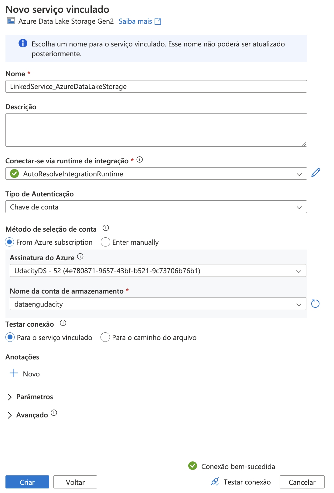
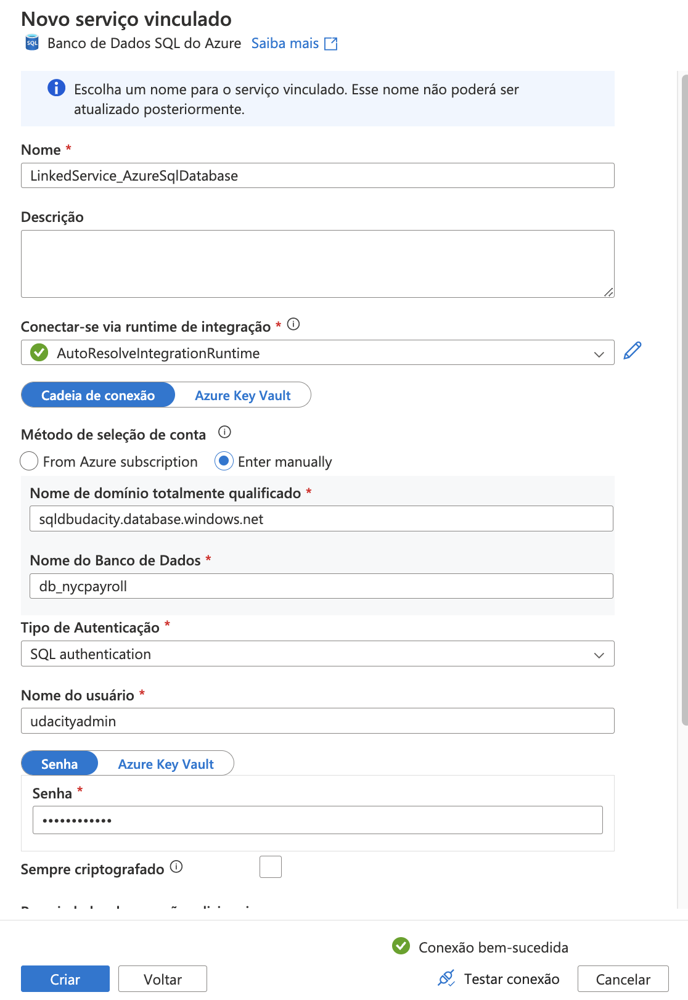
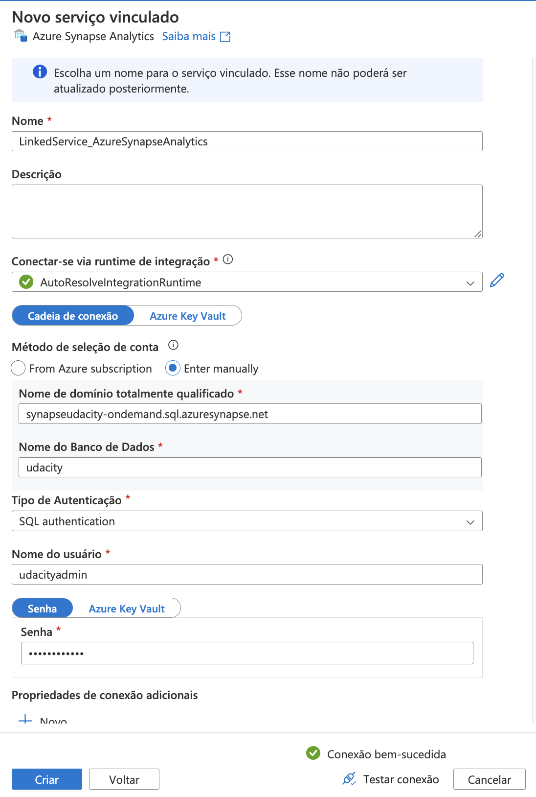

# Udacity Project - Data Engineering with Azure
# Data Integration Pipelines for NYC Payroll Data Analytics

## Setting Up the Environment

To replicate this environment, follow these steps:

1. ***Install Azure CLI***: Ensure that you have the Azure CLI installed on your machine. If not, download and install it from the official Azure CLI documentation.
2. ***Login to Azure Portal***: Run the following command to log in to your Azure account:
```
  az login
```
3. ***Navigate to Repository***: Make sure you are in the directory of this repository, Data-Integration-Pipelines, where the necessary files are located.
4. ***Resource Group Update***: Replace the placeholder for the Resource Group with the name of your provisioned Azure account.

### Instructions: Create and Configure Resources

#### Project Instructions
For this project, you'll do your work in the Azure Portal, using several Azure resources including:

Azure Data Lake Gen2
Azure SQL DB
Azure Data Factory
Azure Synapse Analytics

Instructions for using a temporary Azure account to complete the project are on the previous page.

When you submit your project, it will be assessed against this [project rubric](https://learn.udacity.com/rubric/5487). Take a moment to review it now and periodically throughout the project to make sure you're meeting the requirements.

### Project Data
Download these [.csv files](https://video.udacity-data.com/topher/2022/May/6283aff5_data-nyc-payroll/data-nyc-payroll.zip) that ***provide the data for the project***.

## Step 1: Prepare the Data Infrastructure
Setup Data and Resources in Azure

**1.Create the data lake and upload data**

Log into your temporary Azure account (instructions on the previous page) and create the following resources. Please use the provided resource group to create each resource. You will use these resources for the whole project, in all of the steps, so you'll only need to create one of each:

Create an Azure Data Lake Storage Gen2 (storage account) and associated storage container resource named **adlsnycpayroll-yourfirstname-lastintial**.

In the Azure Data Lake Gen2 creation flow, go to Advanced tab and ensure below options are checked:

Require secure transfer for REST API operations
* Allow enabling anonymous access on individual containers
* Enable storage account key access
* Default to Microsoft Entra authorization in the Azure portal
* Enable hierarchical namespace

Create three directories in this storage container named

* **dirpayrollfiles**
* **dirhistoryfiles**
* **dirstaging**

*dirstaging* will be used by the pipelines we will create as part of the project to store staging data for integration with Azure Synapse. This will be discussed in further pages

Upload these files from the [project data](https://video.udacity-data.com/topher/2022/May/6283aff5_data-nyc-payroll/data-nyc-payroll.zip) to the **dirpayrollfiles** folder

* EmpMaster.csv
* AgencyMaster.csv
* TitleMaster.csv
* nycpayroll_2021.csv

Upload this file (historical data) from the [project data](https://video.udacity-data.com/topher/2022/May/6283aff5_data-nyc-payroll/data-nyc-payroll.zip) to the **dirhistoryfiles** folder

* nycpayroll_2020.csv

***Solution***

```
 az storage account create --name dataengudacity --resource-group ODL-DataEng-255714 --location eastus --sku Standard_LRS --kind StorageV2 --enable-hierarchical-namespace true --allow-blob-public-access true

 az storage container create --name dataengudacity --account-name dataengudacity --auth-mode login

 az storage fs directory create --account-name dataengudacity --file-system dataengudacity --name dirpayrollfiles --auth-mode login

 az storage fs directory create --account-name dataengudacity --file-system dataengudacity --name dirhistoryfiles --auth-mode login

 az storage fs directory create --account-name dataengudacity --file-system dataengudacity --name dirstaging --auth-mode login

 az storage blob upload --account-name dataengudacity --container-name dataengudacity --name dirhistoryfiles/nycpayroll_2020.csv --type block --file Data/nycpayroll_2020.csv --auth-mode login

 az storage blob upload --account-name dataengudacity --container-name dataengudacity --name dirpayrollfiles/EmpMaster.csv --type block --file Data/EmpMaster.csv --auth-mode login

 az storage blob upload --account-name dataengudacity --container-name dataengudacity --name dirpayrollfiles/AgencyMaster.csv --type block --file Data/AgencyMaster.csv --auth-mode login

 az storage blob upload --account-name dataengudacity --container-name dataengudacity --name dirpayrollfiles/TitleMaster.csv --type block --file Data/TitleMaster.csv --auth-mode login

 az storage blob upload --account-name dataengudacity --container-name dataengudacity --name dirpayrollfiles/nycpayroll_2021.csv --type block --file Data/nycpayroll_2021.csv --auth-mode login
```
<br>



**2. Create an Azure Data Factory Resource**

***Solution***

```
 az datafactory create --name DataFactoryUdacity --resource-group ODL-DataEng-255714 --location eastus
```
<br>

<br>

**3. Create a SQL Database**

In the Azure portal, create a SQL Database resource named db_nycpayroll.

In the creation steps, you will be required to create a SQL server, create a server with Service tier: Basic (For less demanding workloads).

In Networking tab, allow both of the below options:

* Allow Azure services and resources to access this server
* Add current client IP address

***Solution***

```
  az sql server create --name SqlDbUdacity --resource-group ODL-DataEng-255714 --location eastus --admin-user udacityadmin --admin-password Xp34Zqo7Tt98


  az sql server firewall-rule create --resource-group ODL-DataEng-255714 --server SqlDbUdacity --name AllowAllAzureIPs --start-ip-address 0.0.0.0 --end-ip-address 0.0.0.0

  az sql server firewall-rule create --resource-group ODL-DataEng-255714 --server SqlDbUdacity --name AllowCurrentClientIP --start-ip-address 187.3.90.2 --end-ip-address 187.3.90.2

  az sql db create --resource-group ODL-DataEng-255714 --server SqlDbUdacity --name db_nycpayroll --edition Basic --zone-redundant false
```
<br>

<br>

**4. Create a Synapse Analytics workspace**

Under Synapse, you will not be allowed to run SQL commands in the default main database. Use the below command to create a database and then refresh the database selector dropdown and choose your created database before running any queries.

```
  CREATE DATABASE udacity
```

You are only allowed one Synapse Analytics workspace per Azure account, a Microsoft restriction.
Create a new Azure Data Lake Gen2 and file system for Synapse Analytics when you are creating the Synapse Analytics workspace in the Azure portal.

***Solution***

```
  az synapse workspace create --name synapseudacity --resource-group ODL-DataEng-255714 --storage-account dataengudacity --file-system dataengudacity --sql-admin-login-user udacityadmin --sql-admin-login-password Xp34Zqo7Tt98 --location "East US" --firewall-rule-name AllowAllWindowsAzureIps

  az synapse workspace firewall-rule create --name "Allow Client IP" --workspace-name synapseudacity --resource-group ODL-DataEng-255714 --start-ip-address 187.3.90.2 --end-ip-address 187.3.90.2
```
<br>
Azure Synapse Service

<br>
Udacity Database in Synapse


**5. Create summary data external table in Synapse Analytics workspace**

Define the file format, if not already, for reading/saving the data from/to a comma delimited file in blob storage.

```
IF NOT EXISTS (SELECT * FROM sys.external_file_formats WHERE name = 'SynapseDelimitedTextFormat') 
  CREATE EXTERNAL FILE FORMAT [SynapseDelimitedTextFormat] 
  WITH ( FORMAT_TYPE = DELIMITEDTEXT ,
  FORMAT_OPTIONS (
  FIELD_TERMINATOR = ',',
  USE_TYPE_DEFAULT = FALSE
  ))
GO

-- Storage path where the result set will persist
IF NOT EXISTS (SELECT * FROM sys.external_data_sources WHERE name = 'dataengudacity_dataengudacity_dfs_core_windows_net') 
  CREATE EXTERNAL DATA SOURCE [dataengudacity_dataengudacity_dfs_core_windows_net] 
  WITH (
      LOCATION = 'abfss://dataengudacity@dataengudacity.dfs.core.windows.net' 
  )
GO
```
* Define the data source to persist the results.***Use the blob storage account name as applicable to you.***

* Create external table that references the dirstaging directory of DataLake Gen2 storage for staging payroll summary data. (Pipeline for this will be created in later section)

```
  CREATE EXTERNAL TABLE [dbo].[NYC_Payroll_Summary](
    [FiscalYear] [int] NULL,
    [AgencyName] [varchar](50) NULL,
    [TotalPaid] [float] NULL
  )
  WITH (
    LOCATION = '/dirstaging', -- Diretório específico no DataLake Gen2
    DATA_SOURCE = [dataengudacity_dataengudacity_dfs_core_windows_net], -- Sua fonte de dados externa
    FILE_FORMAT = [SynapseDelimitedTextFormat] -- Formato de arquivo externo
  )
```

***Solution***
<br>



**6. Create master data tables and payroll transaction tables in SQL DB**

Create Employee Master Data table:
```
  CREATE TABLE [dbo].[NYC_Payroll_EMP_MD](
    [EmployeeID] [varchar](10) NULL,
    [LastName] [varchar](20) NULL,
    [FirstName] [varchar](20) NULL
  ) 
  GO
```
Create Job Title Table:
```
  CREATE TABLE [dbo].[NYC_Payroll_TITLE_MD](
    [TitleCode] [varchar](10) NULL,
    [TitleDescription] [varchar](100) NULL
  )
  GO
```
Create Agency Master table:
```
  CREATE TABLE [dbo].[NYC_Payroll_AGENCY_MD](
    [AgencyID] [varchar](10) NULL,
    [AgencyName] [varchar](50) NULL
  ) 
  GO
```
Create Payroll 2020 transaction data table:
```
  CREATE TABLE [dbo].[NYC_Payroll_Data_2020](
    [FiscalYear] [int] NULL,
    [PayrollNumber] [int] NULL,
    [AgencyID] [varchar](10) NULL,
    [AgencyName] [varchar](50) NULL,
    [EmployeeID] [varchar](10) NULL,
    [LastName] [varchar](20) NULL,
    [FirstName] [varchar](20) NULL,
    [AgencyStartDate] [date] NULL,
    [WorkLocationBorough] [varchar](50) NULL,
    [TitleCode] [varchar](10) NULL,
    [TitleDescription] [varchar](100) NULL,
    [LeaveStatusasofJune30] [varchar](50) NULL,
    [BaseSalary] [float] NULL,
    [PayBasis] [varchar](50) NULL,
    [RegularHours] [float] NULL,
    [RegularGrossPaid] [float] NULL,
    [OTHours] [float] NULL,
    [TotalOTPaid] [float] NULL,
    [TotalOtherPay] [float] NULL
  ) 
  GO
```
Create Payroll 2021 transaction data table:
```
  CREATE TABLE [dbo].[NYC_Payroll_Data_2021](
    [FiscalYear] [int] NULL,
    [PayrollNumber] [int] NULL,
    [AgencyCode] [varchar](10) NULL,
    [AgencyName] [varchar](50) NULL,
    [EmployeeID] [varchar](10) NULL,
    [LastName] [varchar](20) NULL,
    [FirstName] [varchar](20) NULL,
    [AgencyStartDate] [date] NULL,
    [WorkLocationBorough] [varchar](50) NULL,
    [TitleCode] [varchar](10) NULL,
    [TitleDescription] [varchar](100) NULL,
    [LeaveStatusasofJune30] [varchar](50) NULL,
    [BaseSalary] [float] NULL,
    [PayBasis] [varchar](50) NULL,
    [RegularHours] [float] NULL,
    [RegularGrossPaid] [float] NULL,
    [OTHours] [float] NULL,
    [TotalOTPaid] [float] NULL,
    [TotalOtherPay] [float] NULL
  ) 
  GO
```
Create Payroll summary data table:
```
  CREATE TABLE [dbo].[NYC_Payroll_Summary](
    [FiscalYear] [int] NULL,
    [AgencyName] [varchar](50) NULL,
    [TotalPaid] [float] NULL 
  )
  GO
```

***Solution***
<br>


## Step 2: Create Linked Services

**1.Create a Linked Service for Azure Data Lake**

In Azure Data Factory, create a linked service to the data lake that contains the data files

From the data stores, select Azure Data Lake Gen 2
Test the connection

***Solution***
<br>



**2.Create a Linked Service to SQL Database that has the current (2021) data**

If you get a connection error, remember to add the IP address to the firewall settings in SQL DB in the Azure Portal

***Solution***
<br>


**3.Create a Linked Service for Synapse Analytics**

Create the linked service to the SQL pool.

***Solution***
<br>
