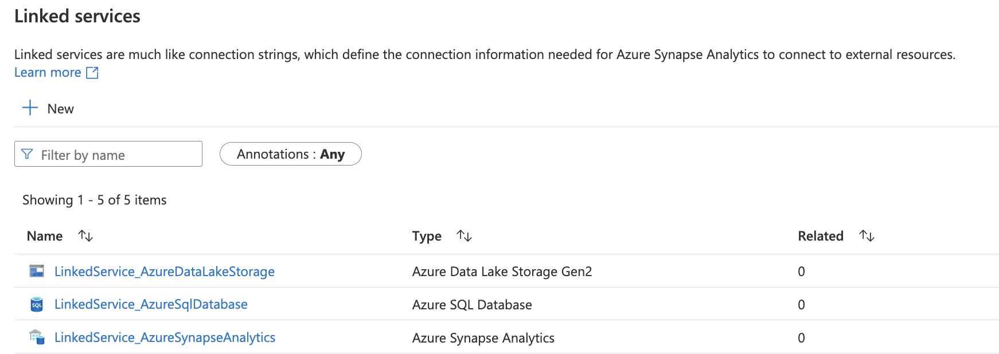
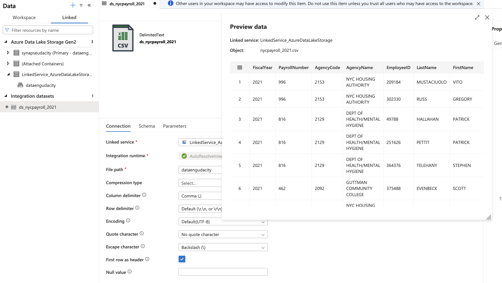
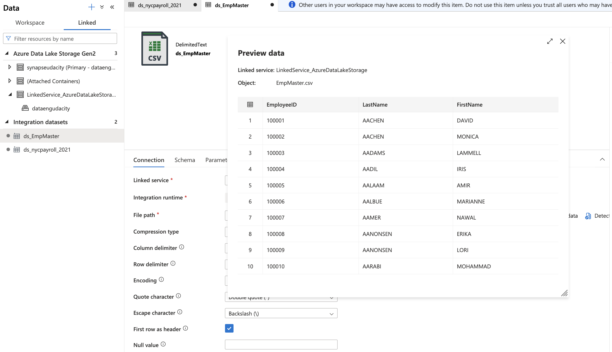
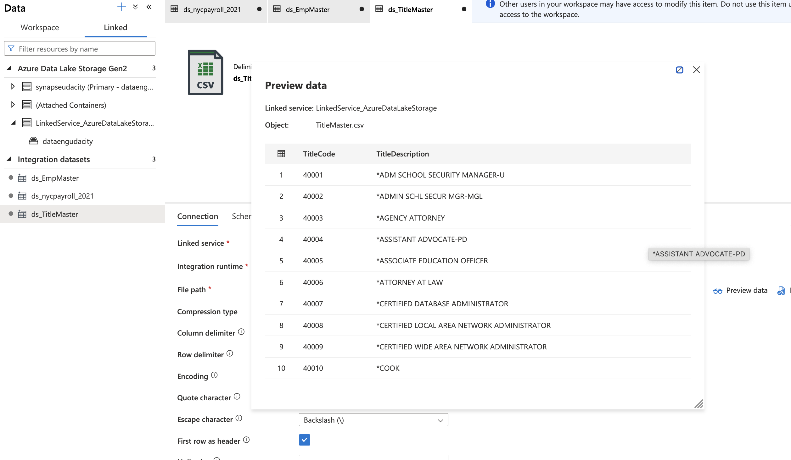
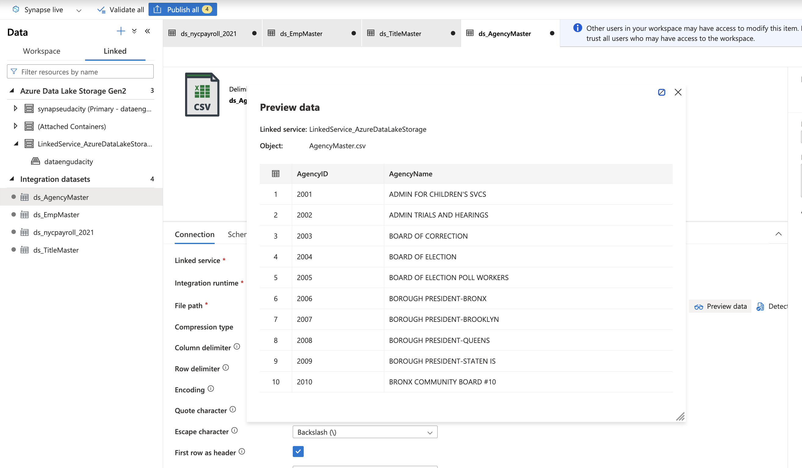
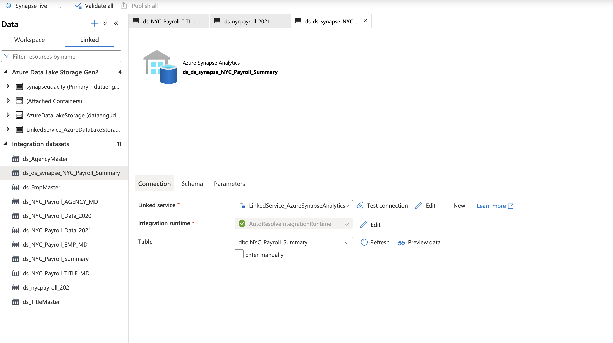
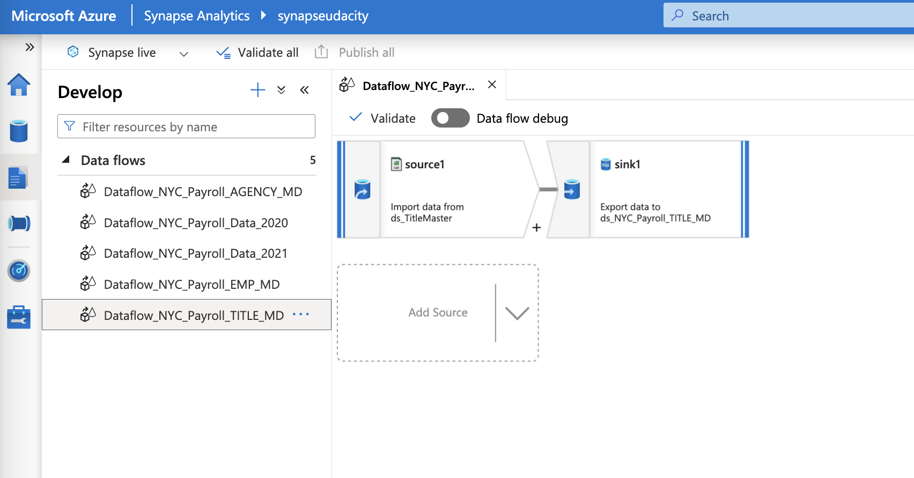
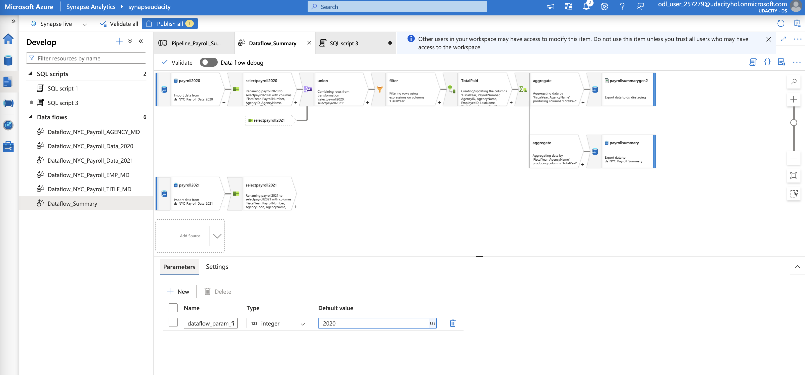
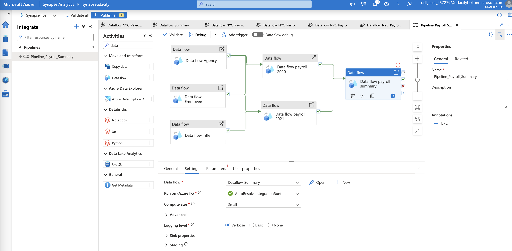
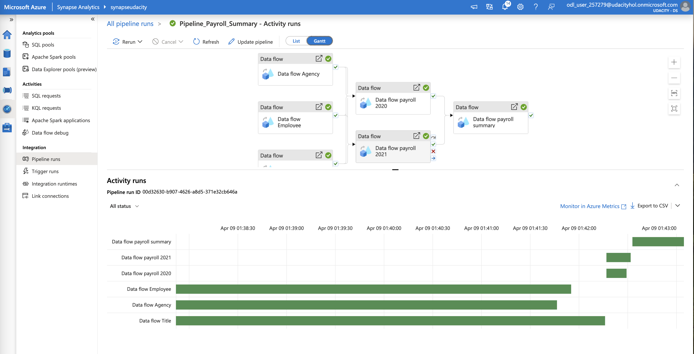

# Udacity Project - Data Engineering with Azure
# Data Integration Pipelines for NYC Payroll Data Analytics

## Setting Up the Environment

To replicate this environment, follow these steps:

1. ***Install Azure CLI***: Ensure that you have the Azure CLI installed on your machine. If not, download and install it from the official Azure CLI documentation.
2. ***Login to Azure Portal***: Run the following command to log in to your Azure account:
```
  az login
```
3. ***Navigate to Repository***: Make sure you are in the directory of this repository, Data-Integration-Pipelines, where the necessary files are located.
4. ***Resource Group Update***: Replace the placeholder for the Resource Group with the name of your provisioned Azure account.

### Instructions: Create and Configure Resources

#### Project Instructions
For this project, you'll do your work in the Azure Portal, using several Azure resources including:

Azure Data Lake Gen2
Azure SQL DB
Azure Data Factory
Azure Synapse Analytics

Instructions for using a temporary Azure account to complete the project are on the previous page.

When you submit your project, it will be assessed against this [project rubric](https://learn.udacity.com/rubric/5487). Take a moment to review it now and periodically throughout the project to make sure you're meeting the requirements.

### Project Data
Download these [.csv files](https://video.udacity-data.com/topher/2022/May/6283aff5_data-nyc-payroll/data-nyc-payroll.zip) that ***provide the data for the project***.

## Step 1: Prepare the Data Infrastructure
Setup Data and Resources in Azure

**1.Create the data lake and upload data**

Log into your temporary Azure account (instructions on the previous page) and create the following resources. Please use the provided resource group to create each resource. You will use these resources for the whole project, in all of the steps, so you'll only need to create one of each:

Create an Azure Data Lake Storage Gen2 (storage account) and associated storage container resource named **adlsnycpayroll-yourfirstname-lastintial**.

In the Azure Data Lake Gen2 creation flow, go to Advanced tab and ensure below options are checked:

Require secure transfer for REST API operations
* Allow enabling anonymous access on individual containers
* Enable storage account key access
* Default to Microsoft Entra authorization in the Azure portal
* Enable hierarchical namespace

Create three directories in this storage container named

* **dirpayrollfiles**
* **dirhistoryfiles**
* **dirstaging**

*dirstaging* will be used by the pipelines we will create as part of the project to store staging data for integration with Azure Synapse. This will be discussed in further pages

Upload these files from the [project data](https://video.udacity-data.com/topher/2022/May/6283aff5_data-nyc-payroll/data-nyc-payroll.zip) to the **dirpayrollfiles** folder

* EmpMaster.csv
* AgencyMaster.csv
* TitleMaster.csv
* nycpayroll_2021.csv

Upload this file (historical data) from the [project data](https://video.udacity-data.com/topher/2022/May/6283aff5_data-nyc-payroll/data-nyc-payroll.zip) to the **dirhistoryfiles** folder

* nycpayroll_2020.csv

***Solution***

```
 az storage account create --name dataengudacity --resource-group ODL-DataEng-255714 --location eastus --sku Standard_LRS --kind StorageV2 --enable-hierarchical-namespace true --allow-blob-public-access true

 az storage container create --name dataengudacity --account-name dataengudacity --auth-mode login

 az storage fs directory create --account-name dataengudacity --file-system dataengudacity --name dirpayrollfiles --auth-mode login

 az storage fs directory create --account-name dataengudacity --file-system dataengudacity --name dirhistoryfiles --auth-mode login

 az storage fs directory create --account-name dataengudacity --file-system dataengudacity --name dirstaging --auth-mode login

 az storage blob upload --account-name dataengudacity --container-name dataengudacity --name dirhistoryfiles/nycpayroll_2020.csv --type block --file Data/nycpayroll_2020.csv --auth-mode login

 az storage blob upload --account-name dataengudacity --container-name dataengudacity --name dirpayrollfiles/EmpMaster.csv --type block --file Data/EmpMaster.csv --auth-mode login

 az storage blob upload --account-name dataengudacity --container-name dataengudacity --name dirpayrollfiles/AgencyMaster.csv --type block --file Data/AgencyMaster.csv --auth-mode login

 az storage blob upload --account-name dataengudacity --container-name dataengudacity --name dirpayrollfiles/TitleMaster.csv --type block --file Data/TitleMaster.csv --auth-mode login

 az storage blob upload --account-name dataengudacity --container-name dataengudacity --name dirpayrollfiles/nycpayroll_2021.csv --type block --file Data/nycpayroll_2021.csv --auth-mode login
```
<br>


**2. Create an Azure Data Factory Resource**

***Solution***

```
 az datafactory create --name DataFactoryUdacity --resource-group ODL-DataEng-255714 --location eastus
```
<br>

<br>

**3. Create a SQL Database**

In the Azure portal, create a SQL Database resource named db_nycpayroll.

In the creation steps, you will be required to create a SQL server, create a server with Service tier: Basic (For less demanding workloads).

In Networking tab, allow both of the below options:

* Allow Azure services and resources to access this server
* Add current client IP address

***Solution***

```
  az sql server create --name SqlDbUdacity --resource-group ODL-DataEng-255714 --location eastus --admin-user udacityadmin --admin-password Xp34Zqo7Tt98


  az sql server firewall-rule create --resource-group ODL-DataEng-255714 --server SqlDbUdacity --name AllowAllAzureIPs --start-ip-address 0.0.0.0 --end-ip-address 0.0.0.0

  az sql server firewall-rule create --resource-group ODL-DataEng-255714 --server SqlDbUdacity --name AllowCurrentClientIP --start-ip-address 187.3.90.2 --end-ip-address 187.3.90.2

  az sql db create --resource-group ODL-DataEng-255714 --server SqlDbUdacity --name db_nycpayroll --edition Basic --zone-redundant false
```
<br>

<br>

**4. Create a Synapse Analytics workspace**

Under Synapse, you will not be allowed to run SQL commands in the default main database. Use the below command to create a database and then refresh the database selector dropdown and choose your created database before running any queries.

```
  CREATE DATABASE udacity
  GO
```

You are only allowed one Synapse Analytics workspace per Azure account, a Microsoft restriction.
Create a new Azure Data Lake Gen2 and file system for Synapse Analytics when you are creating the Synapse Analytics workspace in the Azure portal.

***Solution***

```
  az synapse workspace create --name synapseudacity --resource-group ODL-DataEng-255714 --storage-account dataengudacity --file-system dataengudacity --sql-admin-login-user udacityadmin --sql-admin-login-password Xp34Zqo7Tt98 --location "East US"

  az synapse workspace firewall-rule create --name "AllowAllWindowsAzureIps" --workspace-name synapseudacity --resource-group ODL-DataEng-255714 --start-ip-address 0.0.0.0 --end-ip-address 0.0.0.0

  az synapse workspace firewall-rule create --name "Allow Client IP" --workspace-name synapseudacity --resource-group ODL-DataEng-255714 --start-ip-address 187.3.90.2 --end-ip-address 187.3.90.2
```
<br>
Azure Synapse Service

<br>
Udacity Database in Synapse


**5. Create summary data external table in Synapse Analytics workspace**

Define the file format, if not already, for reading/saving the data from/to a comma delimited file in blob storage.

```
IF NOT EXISTS (SELECT * FROM sys.external_file_formats WHERE name = 'SynapseDelimitedTextFormat') 
  CREATE EXTERNAL FILE FORMAT [SynapseDelimitedTextFormat] 
  WITH ( FORMAT_TYPE = DELIMITEDTEXT ,
  FORMAT_OPTIONS (
  FIELD_TERMINATOR = ',',
  USE_TYPE_DEFAULT = FALSE
  ))
GO

-- Storage path where the result set will persist
IF NOT EXISTS (SELECT * FROM sys.external_data_sources WHERE name = 'dataengudacity_dataengudacity_dfs_core_windows_net') 
  CREATE EXTERNAL DATA SOURCE [dataengudacity_dataengudacity_dfs_core_windows_net] 
  WITH (
      LOCATION = 'abfss://dataengudacity@dataengudacity.dfs.core.windows.net' 
  )
GO
```
* Define the data source to persist the results.***Use the blob storage account name as applicable to you.***

* Create external table that references the dirstaging directory of DataLake Gen2 storage for staging payroll summary data. (Pipeline for this will be created in later section)

```
  CREATE EXTERNAL TABLE [dbo].[NYC_Payroll_Summary](
    [FiscalYear] [int] NULL,
    [AgencyName] [varchar](50) NULL,
    [TotalPaid] [float] NULL
  )
  WITH (
    LOCATION = '/dirstaging/Payroll_Summary.csv', -- Diretório específico no DataLake Gen2
    DATA_SOURCE = [dataengudacity_dataengudacity_dfs_core_windows_net], -- Sua fonte de dados externa
    FILE_FORMAT = [SynapseDelimitedTextFormat] -- Formato de arquivo externo
  )
```

***Solution***
<br>


**6. Create master data tables and payroll transaction tables in SQL DB**

Create Employee Master Data table:
```
  CREATE TABLE [dbo].[NYC_Payroll_EMP_MD](
    [EmployeeID] [varchar](10) NULL,
    [LastName] [varchar](20) NULL,
    [FirstName] [varchar](20) NULL
  ) 
  GO
```
Create Job Title Table:
```
  CREATE TABLE [dbo].[NYC_Payroll_TITLE_MD](
    [TitleCode] [varchar](10) NULL,
    [TitleDescription] [varchar](100) NULL
  )
  GO
```
Create Agency Master table:
```
  CREATE TABLE [dbo].[NYC_Payroll_AGENCY_MD](
    [AgencyID] [varchar](10) NULL,
    [AgencyName] [varchar](50) NULL
  ) 
  GO
```
Create Payroll 2020 transaction data table:
```
  CREATE TABLE [dbo].[NYC_Payroll_Data_2020](
    [FiscalYear] [int] NULL,
    [PayrollNumber] [int] NULL,
    [AgencyID] [varchar](10) NULL,
    [AgencyName] [varchar](50) NULL,
    [EmployeeID] [varchar](10) NULL,
    [LastName] [varchar](20) NULL,
    [FirstName] [varchar](20) NULL,
    [AgencyStartDate] [date] NULL,
    [WorkLocationBorough] [varchar](50) NULL,
    [TitleCode] [varchar](10) NULL,
    [TitleDescription] [varchar](100) NULL,
    [LeaveStatusasofJune30] [varchar](50) NULL,
    [BaseSalary] [float] NULL,
    [PayBasis] [varchar](50) NULL,
    [RegularHours] [float] NULL,
    [RegularGrossPaid] [float] NULL,
    [OTHours] [float] NULL,
    [TotalOTPaid] [float] NULL,
    [TotalOtherPay] [float] NULL
  ) 
  GO
```
Create Payroll 2021 transaction data table:
```
  CREATE TABLE [dbo].[NYC_Payroll_Data_2021](
    [FiscalYear] [int] NULL,
    [PayrollNumber] [int] NULL,
    [AgencyCode] [varchar](10) NULL,
    [AgencyName] [varchar](50) NULL,
    [EmployeeID] [varchar](10) NULL,
    [LastName] [varchar](20) NULL,
    [FirstName] [varchar](20) NULL,
    [AgencyStartDate] [date] NULL,
    [WorkLocationBorough] [varchar](50) NULL,
    [TitleCode] [varchar](10) NULL,
    [TitleDescription] [varchar](100) NULL,
    [LeaveStatusasofJune30] [varchar](50) NULL,
    [BaseSalary] [float] NULL,
    [PayBasis] [varchar](50) NULL,
    [RegularHours] [float] NULL,
    [RegularGrossPaid] [float] NULL,
    [OTHours] [float] NULL,
    [TotalOTPaid] [float] NULL,
    [TotalOtherPay] [float] NULL
  ) 
  GO
```
Create Payroll summary data table:
```
  CREATE TABLE [dbo].[NYC_Payroll_Summary](
    [FiscalYear] [int] NULL,
    [AgencyName] [varchar](50) NULL,
    [TotalPaid] [float] NULL 
  )
  GO
```

***Solution***
<br>


## Step 2: Create Linked Services

**1.Create a Linked Service for Azure Data Lake**

In Azure Data Factory, create a linked service to the data lake that contains the data files

From the data stores, select Azure Data Lake Gen 2
Test the connection

***Solution***
<br>


**2.Create a Linked Service to SQL Database that has the current (2021) data**

If you get a connection error, remember to add the IP address to the firewall settings in SQL DB in the Azure Portal

***Solution***
<br>


**3.Create a Linked Service for Synapse Analytics**

Create the linked service to the SQL pool.

***Solution***
<br>


*All linked service created.*

Azure CLI:
```
  az synapse linked-service create --workspace-name synapseudacity --name LinkedService_AzureDataLakeStorage --file @'/Resources_Json/Step2_Resources/LinkedService_AzureDataLakeStorage.json'

  az synapse linked-service create --workspace-name synapseudacity --name LinkedService_AzureSqlDatabase --file @'/Resources_Json/Step2_Resources/LinkedService_AzureSqlDatabase.json'

  az synapse linked-service create --workspace-name synapseudacity --name LinkedService_AzureSynapseAnalytics --file @'/Resources_Json/Step2_Resources/LinkedService_AzureSynapseAnalytics.json'
```



## Step 3: Create Datasets in Azure Data Factory

**1.Create the datasets for the 2021 Payroll file on Azure Data Lake Gen2**

* Select DelimitedText
* Set the path to the nycpayroll_2021.csv in the Data Lake
* Preview the data to make sure it is correctly parsed

***Solution***



**2. Repeat the same process to create datasets for the rest of the data files in the Data Lake**

* EmpMaster.csv
* TitleMaster.csv
* AgencyMaster.csv
* Remember to publish all the datasets

***Solution***

*EmpMaster.csv* <br>


*TitleMaster.csv* <br>


*AgencyMaster.csv* <br>


**3. Create the dataset for all the data tables in SQL DB**

***Solution***
See below

**4. Create the datasets for destination (target) table in Synapse Analytics**

* dataset for NYC_Payroll_Summary

***Solution***

*All dataset created.*

Azure CLI:
```
  az synapse dataset create --workspace-name synapseudacity --name ds_nycpayroll_2020 --file @'/Resources_Json/Step3_Resources/ds_nycpayroll_2020.json'

  az synapse dataset create --workspace-name synapseudacity --name ds_nycpayroll_2021 --file @'/Resources_Json/Step3_Resources/ds_nycpayroll_2021.json'

  az synapse dataset create --workspace-name synapseudacity --name ds_TitleMaster --file @'/Resources_Json/Step3_Resources/ds_TitleMaster.json'

  az synapse dataset create --workspace-name synapseudacity --name ds_EmpMaster --file @'/Resources_Json/Step3_Resources/ds_EmpMaster.json'

  az synapse dataset create --workspace-name synapseudacity --name ds_AgencyMaster --file @'/Resources_Json/Step3_Resources/ds_AgencyMaster.json'

  az synapse dataset create --workspace-name synapseudacity --name ds_NYC_Payroll_Data_2020 --file @'/Resources_Json/Step3_Resources/ds_NYC_Payroll_Data_2020.json'

  az synapse dataset create --workspace-name synapseudacity --name ds_NYC_Payroll_Data_2021 --file @'/Resources_Json/Step3_Resources/ds_NYC_Payroll_Data_2021.json'

  az synapse dataset create --workspace-name synapseudacity --name ds_NYC_Payroll_AGENCY_MD --file @'/Resources_Json/Step3_Resources/ds_NYC_Payroll_AGENCY_MD.json'

  az synapse dataset create --workspace-name synapseudacity --name ds_NYC_Payroll_EMP_MD --file @'/Resources_Json/Step3_Resources/ds_NYC_Payroll_EMP_MD.json'

  az synapse dataset create --workspace-name synapseudacity --name ds_NYC_Payroll_TITLE_MD --file @'/Resources_Json/Step3_Resources/ds_NYC_Payroll_TITLE_MD.json'

  az synapse dataset create --workspace-name synapseudacity --name ds_NYC_Payroll_Summary --file @'/Resources_Json/Step3_Resources/ds_NYC_Payroll_Summary.json'

  az synapse dataset create --workspace-name synapseudacity --name ds_ds_synapse_NYC_Payroll_Summary --file @'/Resources_Json/Step3_Resources/ds_ds_synapse_NYC_Payroll_Summary.json'

  az synapse dataset create --workspace-name synapseudacity --name ds_dirstaging --file @'/Resources_Json/Step3_Resources/ds_dirstaging.json'
```
<br>


## Step 4: Create Data Flows

In Azure Data Factory, create data flow to load 2020 Payroll data from Azure DataLake Gen2 storage to SQL db table created earlier

  1. Create a new data flow
  2. Select the dataset for 2020 payroll file as the source
  3. Click on the + icon at the bottom right of the source, from the options choose sink. A sink will get added in the dataflow
  4. Select the sink dataset as 2020 payroll table created in SQL db
Repeat the same process to add data flow to load data for each file in Azure DataLake to the corresponding SQL DB tables.

***Solution***

*All Data Flows created.*

Azure CLI:
```
  az synapse data-flow create --workspace-name synapseudacity --name Dataflow_NYC_Payroll_Data_2020 --file @"/Resources_Json/Step4_Resources/Dataflow_NYC_Payroll_Data_2020.json"

  az synapse data-flow create --workspace-name synapseudacity --name Dataflow_NYC_Payroll_Data_2021 --file @"/Resources_Json/Step4_Resources/Dataflow_NYC_Payroll_Data_2021.json"

  az synapse data-flow create --workspace-name synapseudacity --name Dataflow_NYC_Payroll_TITLE_MD --file @"/Resources_Json/Step4_Resources/Dataflow_NYC_Payroll_TITLE_MD.json"

  az synapse data-flow create --workspace-name synapseudacity --name Dataflow_NYC_Payroll_AGENCY_MD --file @"/Resources_Json/Step4_Resources/Dataflow_NYC_Payroll_AGENCY_MD.json"

  az synapse data-flow create --workspace-name synapseudacity --name Dataflow_NYC_Payroll_EMP_MD --file @"/Resources_Json/Step4_Resources/Dataflow_NYC_Payroll_EMP_MD.json"
```
<br>


## Step 5: Data Aggregation and Parameterization

In this step, you'll extract the 2021 year data and historical data, merge, aggregate and store it in DataLake staging area which will be used by Synapse Analytics external table. The aggregation will be on Agency Name, Fiscal Year and TotalPaid.

  1. Create new data flow and name it Dataflow Summary<br>
  2. Add source as payroll 2020 data from SQL DB<br>
  3. Add another source as payroll 2021 data from SQL DB<br>
  4. Create a new Union activity and select both payroll datasets as the source<br>
  5. Make sure to do any source to target mappings if required. This can be done by adding a Select activity before Union<br>
  6. After Union, add a Filter activity, go to Expression builder<br>
    a. Create a parameter named- dataflow_param_fiscalyear and give value 2020 or 2021<br>
    b. Include expression to be used for filtering: toInteger(FiscalYear) >= $dataflow_param_fiscalyear<br>
  7. Now, choose Derived Column after filter<br>
    a. Name the column: TotalPaid<br>
    b. Add following expression: RegularGrossPaid + TotalOTPaid+TotalOtherPay<br>
  8. Add an Aggregate activity to the data flow next to the TotalPaid activity<br>
    a. Under Group by, select AgencyName and FiscalYear<br>
    b. Set the expression to sum(TotalPaid)<br>
  9. Add a Sink activity after the Aggregate<br>
    a. Select the sink as summary table created in SQL db<br>
    b. In Settings, tick Truncate table<br>
  10. Add another Sink activity, this will create two sinks after Aggregate<br>
    a. Select the sink as dirstaging in Azure DataLake Gen2 storage<br>
    b. In Settings, tick Clear the folder<br>

***Solution***
<br>
```
  az synapse data-flow create --workspace-name synapseudacity --name Dataflow_Summary --file @"/Resources_Json/Step5_Resources/Dataflow_Summary.json"
```
<br>


## Step 6: Pipeline Creation

Now, that you have the data flows created it is time to bring the pieces together and orchestrate the flow.

We will create a pipeline to load data from Azure DataLake Gen2 storage in SQL db for individual datasets, perform aggregations and store the summary results back into SQL db destination table and datalake staging storage directory which will be consumed by Synapse Analytics via CETAS.

  1. Create a new pipeline
  2. Include dataflows for Agency, Employee and Title to be parallel
  3. Add dataflows for payroll 2020 and payroll 2021. These should run only after the initial 3 dataflows have completed
  4. After payroll 2020 and payroll 2021 dataflows have completed, dataflow for aggregation should be started.
  5. Refer to the below screenshot. Your final pipeline should look like this

***Solution***
<br>
```
  az synapse pipeline create --workspace-name synapseudacity --name Pipeline_Payroll_Summary --file @"/Resources_Json/Step6_Resources/Pipeline_Payroll_Summary.json"
```
<br>


## Step 7: Trigger and Monitor Pipeline

  1. Select Add trigger option from pipeline view in the toolbar
  2. Choose trigger now to initiate pipeline run
  3. You can go to monitor tab and check the Pipeline Runs
  4. Each dataflow will have an entry in Activity runs list

***Solution***
<br>
[Execution Log](logs/synapseudacity_Activity runs.csv)
<br>
